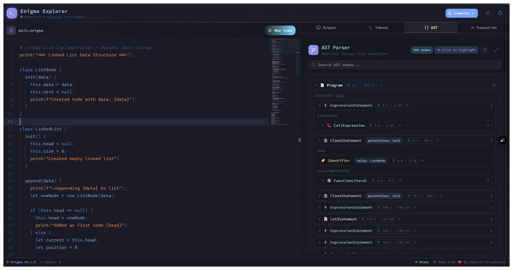

# Enigma Language Explorer


[](https://sonarcloud.io/summary/new_code?id=utkarsh5026_enigma)

An interactive playground for a programming language I built from scratch to understand how the tools we use every day actually work under the hood.



## Why I Built This

Every developer uses programming languages, but how many of us really understand what happens when we write `let x = 5`? I wanted to demystify the fundamentals that power everything we do as programmers.

This project taught me how lexers tokenize code, how parsers build abstract syntax trees, and how interpreters execute programs. These concepts aren't just academic - they're the foundation of every tool we use, from TypeScript to Babel to ESLint. By building Enigma, I learned how all those tools work internally.

The result is both a functioning programming language and an educational tool that visualizes each step of the compilation process. You can write code and watch it transform from text to tokens to an AST to actual execution.

## What is Enigma?

Enigma is a dynamically-typed programming language with:

- **First-class functions and closures** - Functions are values you can pass around
- **Rich control flow** - if/elif/else, while loops, for loops with break/continue
- **Built-in data structures** - Arrays and hash maps
- **Higher-order functions** - Map, filter, reduce patterns
- **Clean syntax** - Inspired by JavaScript and Ruby

### Quick Example

```javascript
// Fibonacci with closures
let fibonacci = fn(n) {
  if (n < 2) { return n; }
  return fibonacci(n - 1) + fibonacci(n - 2);
};

// Higher-order functions
let map = fn(arr, f) {
  let result = [];
  for (let i = 0; i < len(arr); i = i + 1) {
    result[i] = f(arr[i]);
  }
  return result;
};

let numbers = [1, 2, 3, 4, 5];
let doubled = map(numbers, fn(x) { return x * 2; });
```

## 🔍 Interactive Features

The playground includes:

- **Token Analyzer** - See how code gets broken into tokens
- **AST Visualizer** - Explore the tree structure of your program
- **Execution Stepper** - Watch your code execute step by step
- **Language Guide** - Learn Enigma's syntax and features

## How It Works

Enigma follows the classic three-stage compilation pipeline:

### Lexical Analysis

The lexer scans your code character by character and groups them into tokens:

```javascript
let x = 5 + 10;
// Becomes: [LET, IDENTIFIER("x"), ASSIGN, INT(5), PLUS, INT(10), SEMICOLON]
```

### Syntax Analysis

The parser takes tokens and builds an Abstract Syntax Tree (AST) that represents the program's structure:

```
// 5 + (10 * 2) becomes:
//        +
//       / \
//      5   *
//         / \
//        10  2
```

### Evaluation

The interpreter walks the AST and executes your program, managing variables, function calls, and control flow.

## More Examples

### Working with Data

```javascript
let person = {
  name: "Alice",
  skills: ["programming", "design"],
};

let firstSkill = person["skills"][0]; // "programming"
```

### Closures in Action

```javascript
let makeCounter = fn() {
  let count = 0;
  return fn() {
    count = count + 1;
    return count;
  };
};

let counter = makeCounter();
counter();  // 1
counter();  // 2
```

### Recursive Algorithms

```javascript
let quickSort = fn(arr) {
  if (len(arr) < 2) { return arr; }

  let pivot = arr[0];
  let less = [];
  let greater = [];

  for (let i = 1; i < len(arr); i = i + 1) {
    if (arr[i] <= pivot) {
      less[len(less)] = arr[i];
    } else {
      greater[len(greater)] = arr[i];
    }
  }

  return concat(quickSort(less), [pivot], quickSort(greater));
};
```

## What I Learned

Building Enigma taught me several key insights:

**Small syntax decisions matter** - The choice between `fn` and `function` affects how your code reads. Every keyword, operator, and symbol shapes the developer experience.

**Error messages are critical** - A good error message can save hours of debugging. Bad ones make users give up. I learned to prioritize clear, actionable error messages.

**The parser is where the magic happens** - Converting a flat stream of tokens into a hierarchical tree structure requires careful design. Operator precedence, associativity, and recursive descent parsing became second nature.

**Closures are harder than they look** - Implementing closures correctly required understanding scope chains, environment management, and how functions capture their context.

## Resources That Helped

If you want to build your own language, these resources are invaluable:

- "Writing An Interpreter In Go" by Thorsten Ball
- "Crafting Interpreters" by Robert Nystrom

## 🚀 Future Plans

Features I'm considering adding:

- Pattern matching for elegant data destructuring
- Module system for better code organization
- Optional type hints with inference

## License

MIT License - Feel free to explore, learn, and build upon this project.

---

If you're curious about how programming languages work, I hope Enigma helps demystify the process. The best way to understand something is to build it yourself.
